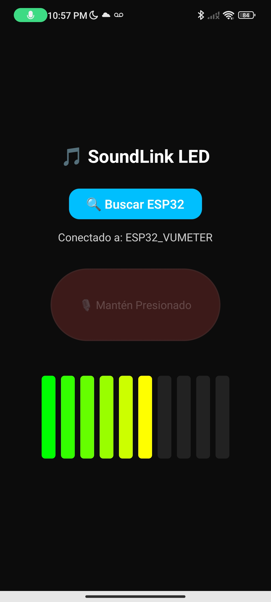

# 🎵 SoundLink LED

**SoundLink LED** es un vúmetro visual de 10 LEDs controlado en tiempo real por el sonido captado desde una aplicación móvil.  
Utiliza **Bluetooth Low Energy (BLE)** para una comunicación inalámbrica eficiente entre un smartphone y un **ESP32-C3 SuperMini**.

---

## 📸 Demostración

### Interfaz de la Aplicación  
> 

### Funcionamiento  
> 

---

## ✨ Características Principales

- 🎚️ **Visualización en Tiempo Real:** Los LEDs reaccionan instantáneamente al volumen del sonido captado por el micrófono del teléfono.  
- 📡 **Control Inalámbrico:** Comunicación robusta y de bajo consumo gracias a **Bluetooth Low Energy (BLE)**.  
- 📱 **Aplicación Multiplataforma:** Desarrollada con **React Native (Expo)**, funciona tanto en Android como en iOS.  
- 💡 **Hardware de Bajo Costo:** Usa el microcontrolador **ESP32-C3 SuperMini**, económico y fácil de programar.  
- 🧠 **Interfaz Sencilla:** Una UI limpia y funcional para escanear, conectar y activar el vúmetro.

---

## ⚙️ ¿Cómo Funciona?

El sistema se compone de **dos partes** que se comunican entre sí mediante BLE:

### 📲 Aplicación Móvil (React Native)
- Utiliza `expo-av` para acceder al micrófono y medir el nivel de audio (en decibelios).  
- Convierte los valores de sonido (negativos) en una escala de **0 a 100**.  
- Con `react-native-ble-plx`, escanea dispositivos BLE cercanos, se conecta al ESP32 y le envía el valor del nivel de sonido en tiempo real.  
- Cada dato enviado (por ejemplo, `"75"`) representa la intensidad sonora actual.

### ⚡ Firmware (ESP32)
- Implementa un **servidor BLE** con un servicio y una característica UUID específica.  
- Espera conexión desde la app móvil.  
- Al recibir datos, convierte la cadena `"75"` en un número entero y lo **mapea** (`map()`) a una escala de 0–10 LEDs.  
- Enciende el número correspondiente de LEDs mediante `digitalWrite()`.

---

## 🛠️ Tecnologías Utilizadas

### 🔩 Hardware
- ESP32-C3 SuperMini  
- 10 LEDs (cualquier color)  
- 10 resistencias (220 Ω o 330 Ω)  
- Protoboard y cables jumpers  

### 💻 Software
#### Firmware (ESP32)
- Arduino IDE o PlatformIO  
- Lenguaje: **C++**  
- Librería: `BLEDevice.h` para ESP32  

#### Aplicación Móvil
- **React Native (Expo)**  
- Lenguaje: **JavaScript / JSX**  
- Librerías clave:
  - `react-native-ble-plx` → manejo de Bluetooth BLE  
  - `expo-av` → acceso al micrófono  
  - `react-native-svg` → visualización del vúmetro  

---

## 🚀 Puesta en Marcha

### 🧰 Parte 1: Montaje y Firmware (ESP32)
1. **Monta el circuito:**  
   Conecta los 10 LEDs a los pines GPIO:  
   `0, 1, 2, 3, 5, 6, 7, 8, 9, 10`.  
   - Ánodo (pata larga) → resistencia → pin GPIO  
   - Cátodo (pata corta) → GND  

2. **Configura el entorno:**  
   - Instala el soporte de **ESP32** en Arduino IDE.  
   - Abre el código `SoundLink_LED.ino`.  
   - Selecciona la placa **ESP32C3 Dev Module** y el puerto correcto.

3. **Carga el programa** y abre el monitor serie.  
   Verás el mensaje:  
```

✅ Listo. Anunciando como 'ESP32C3_Vumetro'...
🔗 Abre la app para conectar.

````

---

### 📱 Parte 2: Aplicación Móvil (React Native)
1. **Instala Node.js** si no lo tienes.  
2. **Clona este repositorio:**
```bash
git clone https://github.com/tu-usuario/SoundLink_LED.git
cd SoundLink_LED
````

3. **Instala dependencias:**

   ```bash
   npm install
   ```

   > Este comando instala automáticamente todas las librerías necesarias (BLE, micrófono, animaciones, etc.)

4. **Ejecuta la app:**

   ```bash
   npx expo start
   ```

5. **Escanea el código QR** con la app **Expo Go** en tu teléfono.

---

## 🎚️ Uso

1. Asegúrate de que el ESP32 esté encendido y visible por BLE.
2. Abre la app **SoundLink LED**.
3. Presiona **"🔍 Buscar ESP32"** y selecciona `ESP32C3_Vumetro`.
4. Mantén presionado el botón del micrófono 🎙️.
5. Habla o pon música cerca de tu teléfono…
   👉 ¡Los LEDs se moverán al ritmo del sonido!

---

## 🧩 Estructura del Proyecto

```
SoundLink_LED/
│
├── App.js                 # Código principal de la aplicación
├── package.json           # Dependencias y configuración del proyecto
├── README.md              # Documentación del proyecto (este archivo)
├── .gitignore             # Archivos y carpetas ignoradas por git
├── assets/                # Imágenes, íconos, etc.
└── firmware/
    └── SoundLink_LED.ino  # Código Arduino para el ESP32
```

---

## 🧠 Consejos

* Si ves **múltiples instancias del dispositivo BLE**, apaga y enciende el ESP32 o borra el caché Bluetooth del teléfono.
* Puedes cambiar el nombre del dispositivo en:

  ```cpp
  BLEDevice::init("ESP32C3_Vumetro");
  ```
* Para mejorar precisión del vúmetro, ajusta el mapeo `map()` en el código del ESP32.

---

## ❤️ Hecho con amor

por **Salvador Antonio Pantoja Vera**
